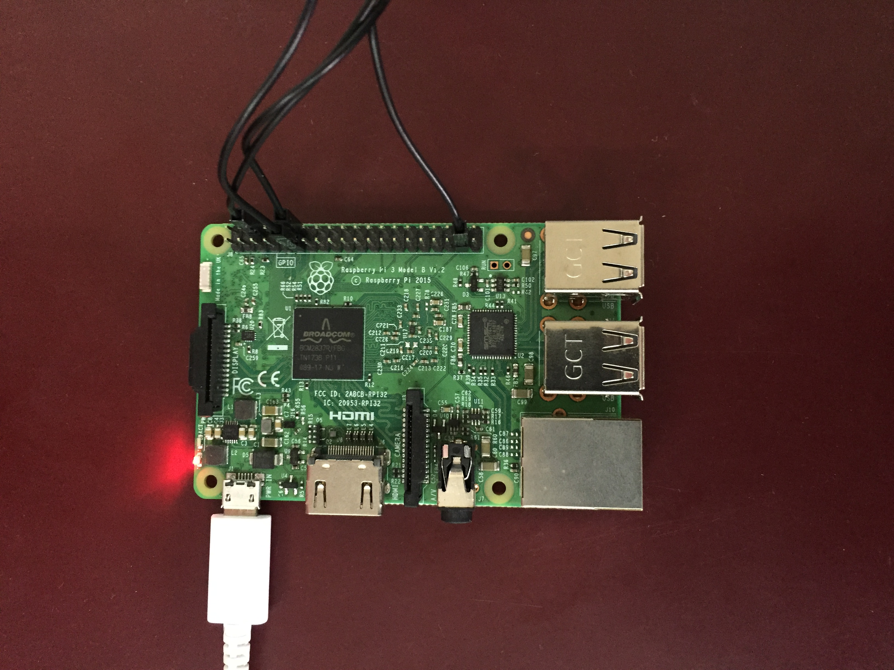

# 🤖 Gesture-Controlled Home Automation

Control your home appliances with hand gestures using Computer Vision and Raspberry Pi!

[](https://youtu.be/di_7B-S1Npw)
[](https://www.python.org/)
[](https://opencv.org/)

## 📹 Demo

https://github.com/user-attachments/assets/demo

> Click the YouTube badge above to watch the full demonstration

## 🎯 Overview

This project implements a real-time gesture recognition system that allows you to control LEDs (or any appliances) connected to a Raspberry Pi using hand gestures captured through a webcam. The system uses computer vision to detect finger count and sends control commands over a socket connection.

## ✨ Features

- **Real-time Gesture Recognition**: Detects hand gestures using OpenCV
- **Wireless Control**: Communicates over local network via socket programming
- **Multiple Device Control**: Control up to 3 devices independently
- **Mode Switching**: Toggle between ON/OFF modes with a 5-finger gesture
- **Visual Feedback**: Live display of hand contours, thresholded image, and current status

## 🎮 Gesture Controls

| Gesture | Fingers | Action |
|---------|---------|--------|
| ✌️ | 2 fingers | Toggle LED 1 |
| 🤟 | 3 fingers | Toggle LED 2 |
| 🖖 | 4 fingers | Toggle LED 3 |
| ✋ | 5 fingers | Switch Mode (ON/OFF) |

## 🛠️ Hardware Requirements

### For Client (Computer)
- Webcam or built-in camera
- Computer with Python support (Windows/Linux/Mac)

### For Server (Raspberry Pi)
- Raspberry Pi (any model with GPIO pins)
- 3x LEDs
- 3x 220Ω Resistors
- Breadboard and jumper wires
- Power supply for Raspberry Pi

## 🔌 Circuit Diagram

### GPIO Pin Configuration




**Pin Connections:**
- LED 1 → GPIO 18 (Pin 12)
- LED 2 → GPIO 17 (Pin 11)
- LED 3 → GPIO 19 (Pin 35)
- Ground → GND pins

## 📦 Software Requirements

### Client System
- Python 3.7+
- OpenCV (cv2)
- NumPy

### Raspberry Pi
- Raspbian OS
- Python 3.7+
- RPi.GPIO library

## ⚙️ Installation

### Step 1: Raspberry Pi Setup

1. **Install Raspbian OS** on your Raspberry Pi

2. **Copy the server script** to your Raspberry Pi:
   ```bash
   scp Pi/server.py pi@<raspberry_pi_ip>:~/
   ```

3. **Find your Raspberry Pi's IP address:**
   ```bash
   ifconfig
   ```

4. **Edit the server script** and update the host IP:
   ```python
   host = "192.168.43.250"  # Replace with your Pi's IP
   ```

5. **Install dependencies** (if not already installed):
   ```bash
   pip install RPi.GPIO
   ```

6. **Run the server:**
   ```bash
   python server.py
   ```

### Step 2: Client System Setup

1. **Clone this repository:**
   ```bash
   git clone https://github.com/yourusername/Automation-using-fingure-gesture.git
   cd Automation-using-fingure-gesture
   ```

2. **Install required packages:**
   ```bash
   pip install -r requirements.txt
   ```

3. **Update the host IP** in `finger.py`:
   ```python
   host = "192.168.43.250"  # Replace with your Pi's IP
   ```

4. **Run the client:**
   ```bash
   python finger.py
   ```

## 🚀 Usage

1. **Start the server** on Raspberry Pi first
2. **Run the client** on your computer
3. **Position your hand** in the green rectangle on the screen
4. **Show fingers** to control the LEDs:
   - Start with mode selection (5 fingers) to enable ON mode
   - Use 2, 3, or 4 fingers to control respective LEDs
   - Each gesture has a 2-second cooldown to prevent accidental triggers

### Visual Windows

The application displays three windows:
- **Gesture**: Main camera feed with status text
- **Thresholded**: Binary image of hand
- **Contours**: Hand contours and convex hull

Press `ESC` to exit the application.

## 📸 Working Demo


## 🔬 How It Works

### Image Processing Pipeline

1. **Capture Frame**: Read video frame from webcam
2. **ROI Extraction**: Extract Region of Interest (green rectangle)
3. **Preprocessing**: Convert to grayscale and apply Gaussian blur
4. **Thresholding**: Apply Otsu's binarization
5. **Contour Detection**: Find hand contour
6. **Convex Hull**: Calculate convex hull and defects
7. **Finger Counting**: Count fingers using convexity defects and angle calculation
8. **Command Transmission**: Send control commands via socket

### Communication Protocol

- Client-Server architecture using TCP sockets
- Commands: `on_led1`, `off_led1`, `on_led2`, `off_led2`, `on_led3`, `off_led3`, `close_all`
- Port: 9345

## 🔧 Configuration

### Adjusting Detection Sensitivity

In `finger.py`, modify these parameters:

```python
# ROI size
cv2.rectangle(img, (300,300), (100,100), (0,255,0),0)

# Gaussian blur kernel
value = (35, 35)

# Angle threshold for finger detection
if angle <= 90:  # Adjust this value
```

### Changing GPIO Pins

In `Pi/server.py`, update the pin numbers:

```python
led1 = 18  # Change to your desired GPIO pin
led2 = 17
led3 = 19
```

## 🐛 Troubleshooting

**Camera not detected:**
- Ensure webcam is connected and not in use by another application
- Try changing camera index: `cap = cv2.VideoCapture(1)`

**Connection refused:**
- Verify both devices are on the same network
- Check firewall settings
- Ensure server is running before starting client

**Hand not detected:**
- Ensure good lighting conditions
- Position hand within the green rectangle
- Adjust contrast/brightness if needed

## 🤝 Contributing

Contributions are welcome! Feel free to:
- Report bugs
- Suggest new features
- Submit pull requests

## 📄 License

This project is open source and available under the MIT License.

## 👨‍💻 Author

Created with ❤️ for the maker community

## 🔗 Resources

- [OpenCV Documentation](https://docs.opencv.org/)
- [Raspberry Pi GPIO](https://www.raspberrypi.org/documentation/usage/gpio/)
- [Socket Programming in Python](https://docs.python.org/3/library/socket.html)

---

⭐ **Star this repo** if you found it helpful!
